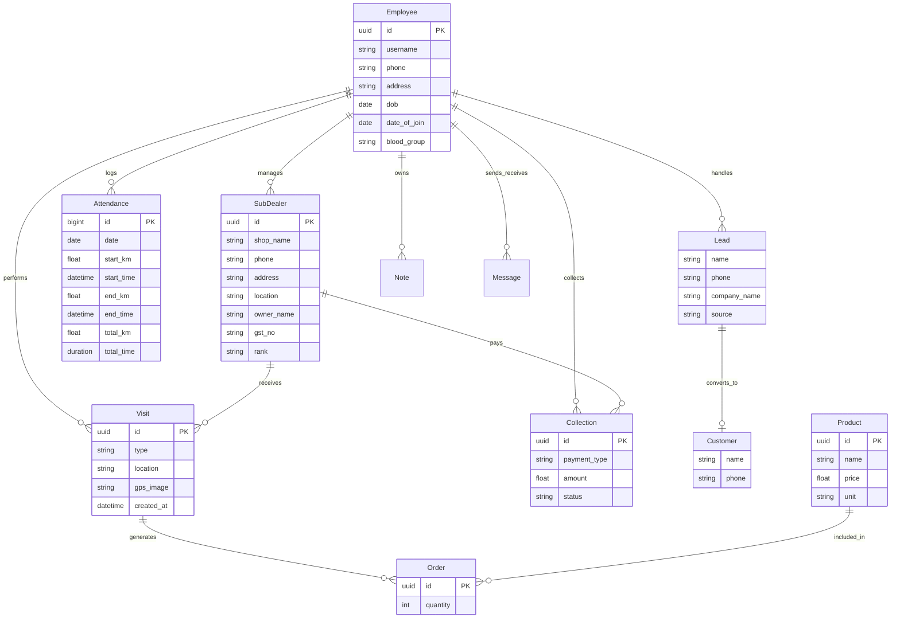

# SKS Backend System

A robust, production-ready Django REST Framework (DRF) backend system designed for field employee tracking, sales management, and CRM.

## 🚀 Quick Start

### Prerequisites
- **Python**: `3.12+`
- **Package Manager**: [uv](https://github.com/astral-sh/uv) (Recommended) or `pip`
- **Docker**: Latest version (for PostgreSQL Database)
- **Docker Compose**: Latest version (for running PostgreSQL)

### Installation & Setup

1. **Sync Dependencies**
   ```bash
   uv sync
   ```
   *Or using pip:*
   ```bash
   pip install -r requirements.txt
   ```

2. **Run docker-compose**
   ```bash
   docker-compose up -d
   ```

3. **Database Migrations**
   ```bash
   # python manage.py makemigrations
   python manage.py migrate
   ```
   
   ```bash
   # Create Super User only First time run
   python manage.py createsuperuser
   ```

4. **Run Development Server**
   ```bash
   python manage.py runserver
   ```

## 📖 API Documentation

For detailed information on the Attendance and Visit tracking APIs, refer to the [Tracking API Documentation](tracking.md) file.

- **Sales API Documentation**: refer to the [Sales API Documentation](sales.md) file.
- **Notification API & Setup Documentation**: refer to the [Notification API Documentation](Notification.md) file.

## 📊 Database Structure



## 🛠 Features

### 🔐 Authentication & Security
- **JWT Based**: Secure authentication using `djangorestframework-simplejwt`.
- **Custom User Model**: `Employee` with Role-based access control.
- **Login Flow**: Returns `must_change_password` flag; users must change their password on first login.
- **UUIDs**: Used for primary keys on all major entities to prevent ID enumeration.

### 📖 API Documentation
Automated OpenAPI schema generation using `drf-spectacular`.
- **Swagger UI**: `/api/docs/` (Interactive explorer)
- **Redoc**: `/api/redoc/` (Clean documentation)
- **Schema**: `/api/schema/` (Raw OpenAPI JSON/YAML)

### 👥 Employee Management
- **Create Employee**: Restricted to **Owners**, **Managers**, and **Sys-Admins**.
- **Role Hierarchy**: System-level enforcement of permissions.
- **Mandatory Password Change**: New accounts are flagged for a mandatory password reset.

### 📍 Field Tracking (Real-time)
- **Attendance Management**: Capture GPS location and odometer readings at start/end of day.
- **Visit Logs**: Real-time tracking of dealer visits with GPS verification.
- **Idempotent Sync**: Robust bulk sync logic using `client_id` to handle offline data uploads without duplicates.

### 💼 Sales & CRM
- **Product Catalog**: Manage items with pricing and units.
- **Orders & Collections**: Record sales orders and payment collections during visits.
- **Lead Pipeline**: Track potential customers from lead to conversion.

### 💬 Communication
- **Internal Notes**: Create and share notes among employees.
- **Messaging**: Peer-to-peer messaging system for internal coordination.

## 🧪 Testing

The project uses `pytest` with `factory_boy` for high-quality, realistic data simulation.

### Run All Tests
```bash
pytest
```

### Run with Coverage
```bash
pytest --cov=.
```

### Test Structure
Each app follows a standardized testing pattern:
```text
app_name/
├── tests/
│   ├── factories.py      # FactoryBoy factories for data simulation
│   ├── test_models.py    # Model integrity and constraint tests
│   ├── test_api.py       # API endpoint and business logic tests
```

## 📁 Project Structure

- `users/`: Custom user model and employee-specific logic.
- `dealers/`: Management of sub-dealers and partners.
- `tracking/`: GPS tracking, attendance, and visit logs.
- `sales/`: Product catalog, orders, and payment collections.
- `crm/`: Leads and customer management.
- `communication/`: Internal notes and messaging system.
- `notifications/`: Notification app for managing devices, preferences, and sending push alerts synchronously.
- `core/`: Shared utilities and base configurations.
- `config/`: Project-level settings and root URL configuration.

## 🔒 Production Considerations

- **Data Integrity**: Enforced via database-level `UniqueConstraint` and indexes on frequently queried fields.
- **Validation**: Strict DRF serializer validation for all inputs.
- **Performance**: Indexed `client_id`, `employee`, and `date` fields for fast lookups.
- **API Documentation**: Automated OpenAPI schema generation via `drf-spectacular`.


test super user 

username : sks_dev 
password : SKS@dev
